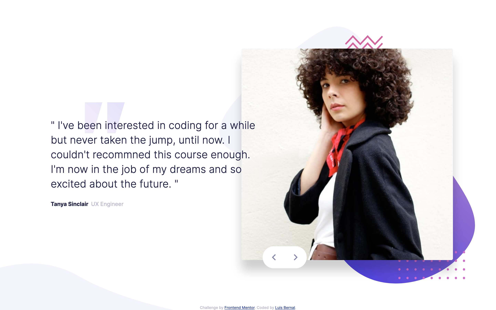

# Frontend Mentor - Coding bootcamp testimonials slider solution

This is a solution to the [Coding bootcamp testimonials slider challenge on Frontend Mentor](https://www.frontendmentor.io/challenges/coding-bootcamp-testimonials-slider-4FNyLA8JL). Frontend Mentor challenges help you improve your coding skills by building realistic projects.

## Table of contents

- [Overview](#overview)
  - [The challenge](#the-challenge)
  - [Screenshot](#screenshot)
  - [Links](#links)
- [My process](#my-process)
  - [Built with](#built-with)
  - [What I learned](#what-i-learned)
  - [Continued development](#continued-development)
  - [Useful resources](#useful-resources)

## Overview

### The challenge

Users should be able to:

- View the optimal layout for the component depending on their device's screen size
- Navigate the slider using either their mouse/trackpad or keyboard

### Screenshot

### Links

- Solution URL: [https://github.com/FrontendMentor-Lecap/Bootcamp-Testimonials-Slider]
- Live Site URL: [https://frontendmentor-lecap.github.io/Bootcamp-Testimonials-Slider/]

## My process

### Built with

- Semantic HTML5 markup
- CSS custom properties
- Flexbox
- Mobile-first workflow
- Vanilla Javascript

### What I learned

This challenge was wholesome for me in every aspect. Although the basic layout can be seen as not that challenging it was a lot of work for me in order to make it workable with Javascript. It first created to different articles, one for each testimony, and it was ok. Unfortunately this approach was not expandable or sizeable in case I added more user testimonies. If I continued using that approach then it was necessary to change HTML while when a testimony was added or removed. Due to this I decided to start from scratch.

The other challenge was to make the navigation buttons workable for all users and at the same time maintain a correct position in respect of the person's image.

Finally the biggest challenge was adding Javascript, and to make it possible to go from the last user to the first by also pressing the next button. An array with all the user objects had to be created and functions to toggle between the users was used. I tried this approach but was always uncapable of creating this functions, that is why I searched internet and arrived to a code written by one of Frontend Mentor users. JS part was not created by me, but learned with the code created by our partner, in the useful resources I will acknowledge him and his code.

### Continued development

I need to continue working on my Javascript knowledge and applications. I know the basics and how it is used but the transition between theory and practice is sometimes really tough. Practicing and creating different projects will give me the experience I need to be comfortable with the language in order to create my own projects without the need of searching all over internet for basic solutions. I also need to continue reading and playing with DOM as it is the most important thing to learn in order to create interactive and different web pages.

### Useful resources

- [https://github.com/saakarg/coding-bootcamp-testimonial-slider] - I created all of the JS code from this guy's project. All I know about him is he is called Saakar Gogia and he is Taurus. Nonetheless I thank him for helping me finish my project by using information from his code.
